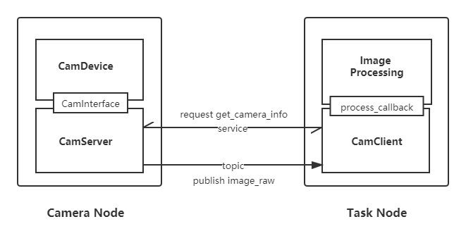

# rm_cam模块

## 1.简介

`rm_cam`是`rmoss_core`中的一个基础功能包，提供了usb相机ROS节点和虚拟相机ROS节点相关功能，同时，实现了一个`camera C/S`模型，封装了图像获取等操作，只需要注重图像处理部分。主要实现功能如下：

- usb相机ROS节点 ：获取usb相机图像，并发布成ROS topic (`sensor_msgs::msg::Image`).
- 基于图片与视频的虚拟相机ROS节点：将视频或者图片发布成ROS topic (`sensor_msgs::msg::Image`).
- `camera C/S`模型：`CamServer`负责将相机获取的图像发布成ROS topic ， `CamClient` 负责订阅图像ROS topic，并调用`callback`进行图像处理。

`camera C/S`模型如下图所示：



同时相机节点支持二次开发，支持自定义相机扩展，该模块将相机操作(`CamDevice`) 与相机ROS节点 (`CamServer`) 进行解偶，对于不同的工业相机有不同的驱动，通过该相机接口，可以无需关心ROS部分，快速实现相机ROS节点, 支持[ROS Composition](https://docs.ros.org/en/galactic/Tutorials/Composition.html)方式启动, 详细介绍参考二次开发部分。

文件说明：

* `cam_interface.hpp`：定义通用相机设备接口
* `usb_cam.hpp/cpp` : usb相机设备实现。
* `virtual_cam.hpp/cpp`：虚拟相机设备实现，支持基于图片和基于视频两种方式。
* `cam_server.hpp/cpp` :  `CamServer` 模块，负责将相机获取的图像发布成ROS topic，支持获取相机参数服务。
* `cam_client.hpp/cpp` :  `CamClient` 模块，订阅图像ROS topic，并调用`callback`进行图像处理。
* `usb_cam_node.hpp/cpp` ，`virtual_cam_node.hpp/cpp` :  ROS顶层模块（基于`UsbCam`,`VirtualCam`和`CamServer`），实现usb相机节点和虚拟相机节点。
* `usb_cam_main.cpp` ，`virtual_cam_main.cpp` :  usb相机节点和虚拟相机节点main入口。

## 2.快速使用

### usb相机：

launch方式运行：

```bash
ros2 launch rm_cam usb_cam.launch.py  #使用默认/dev/video0
```

* 参数在yaml文件中（`config/cam_params.yaml`）

### 虚拟相机：

launch方式运行图片虚拟相机：

```bash
ros2 launch rm_cam virtual_image_cam.launch.py  #使用默认图片resource/test.png
```

* 可在launch文件中配置，图片路径`image_path`（必须），相机参数`camera_k` , `fps` 等参数。

采用`rqt_image_veiw` 查看图像`topic` 

```bash
ros2 run rqt_image_veiw rqt_image_veiw
```

命令行方式运行视频虚拟相机

```bash
ros2 run rm_cam virtual_cam --ros-args -p "video_path:=/home/ubuntu/test.avi"
```

* 至少需要一个参数`video_path`

### ROS Composition启动

launch方式运行composition测试demo

```python
ros2 launch rm_cam composition.launch.py
```

* 先创建容器`rm_container` ，然后将相机节点`rm_cam::VirtualCamNode` 加载到容器中，支持继续加载多个节点。

## 3.二次开发

cam_interface接口

* 整个相机模块通过`CamInterface` 接口，该接口定义了设备规范，实现了模块的可扩展性，以下为接口API

```c++
//接口
virtual bool open() = 0;  // 打开设备
virtual void close() = 0;  // 关闭设备
virtual bool is_open() = 0;  //检测设备是否打开
virtual bool grab_image(cv::Mat & imgae) = 0;  //获取图像
//采用map存储参数,需要在构造函数中进行设置初始值params_[key]=init_value,
//通过set_parameter和get_parameter()设置获取参数，未进行初始化的参数放回false
std::unordered_map<CamParamType, int> params_;
bool set_parameter(CamParamType type,int value);
bool get_parameter(CamParamType type,int& value);
```

相机接口运行模型 （简化模型，不考虑运行时修改参数）

* 一般运行流程：`set_parameter()`->`open()`->`grab_image()`->`close()` 
* 参数设置应该在相机关闭下进行设置，若需要修改相机参数（如曝光），需要先重启相机进行设置，即：`close()`-> `set_parameter()`->`open()` 

相机参数（CamParamType）说明：

```c++
CamParamType::Width;  //分辨率宽
CamParamType::Height;  //分辨率高
CamParamType::AutoExposure;  //自动曝光,1代表自动曝光设置，0代表手动曝光设置
CamParamType::Exposure;  //曝光值
CamParamType::Brighthness;  //亮度
CamParamType::AutoWhiteBalance;  //自动白平衡，1代表自动白平衡设置，0代表手动白平衡设置
CamParamType::WhiteBalance;  //白平衡
CamParamType::Gain;  //增益
CamParamType::Gamma;  //伽马值
CamParamType::Contrast;  //对比度
CamParamType::Saturation;  //饱和度
CamParamType::Hue;  //色调
CamParamType::Fps;  //帧率
```

- 不同相机值参数的取值范围不同，需要根据具体相机型号进行参数设置，仅支持整型设置。
- 帧率参数Fps用于ROS节点发布图像，对于一般相机，可以忽略不用设置（某些特殊相机需要设置高帧率模式）。

ROS相机节点

* 基于`CamInterface`和`CamServer`，可以实现自定义相机的ROS顶层模块，首先对自定义相机设备（继承`CamInterface`）进行初始化，然后传给`CamServer`进行相应任务。
* 以usb_cam为例，利用`UsbCam`和`CamServer`，可快速实现usb相机节点`UsbCamNode`，`UsbCamNode` = `UsbCam` + `CamServer` 。
